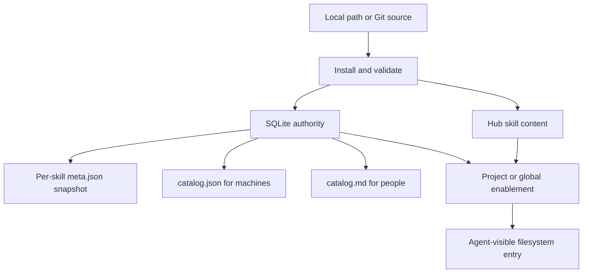
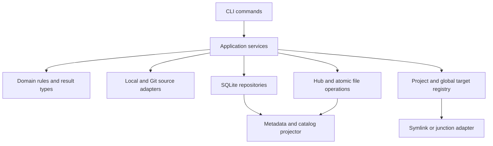
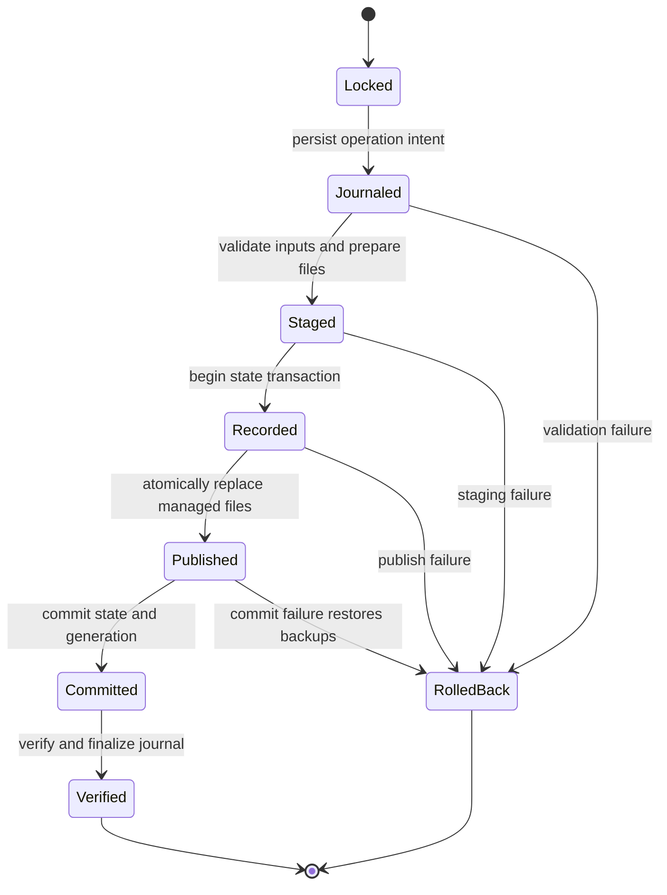
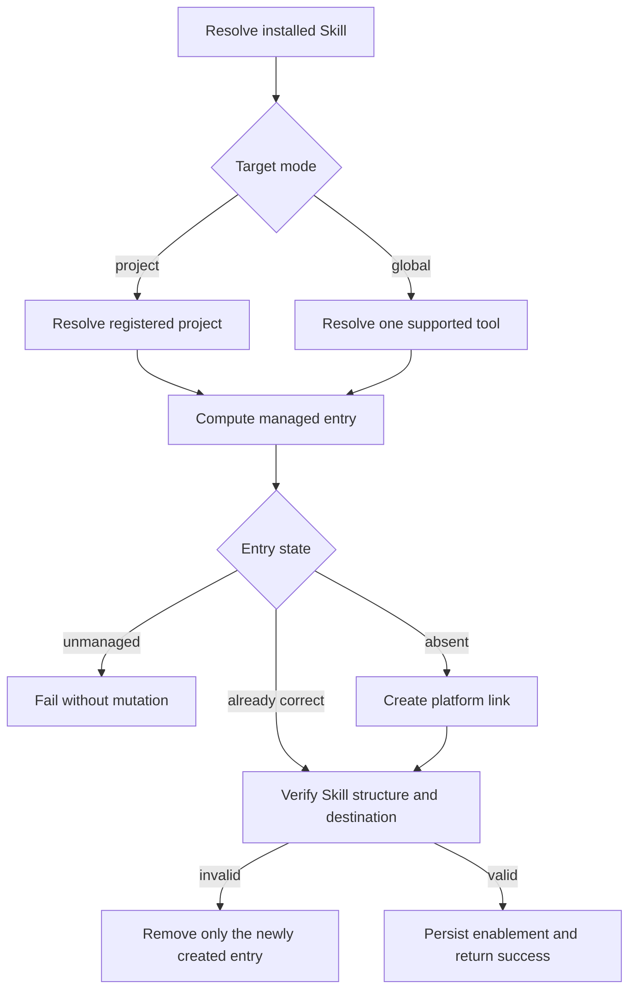
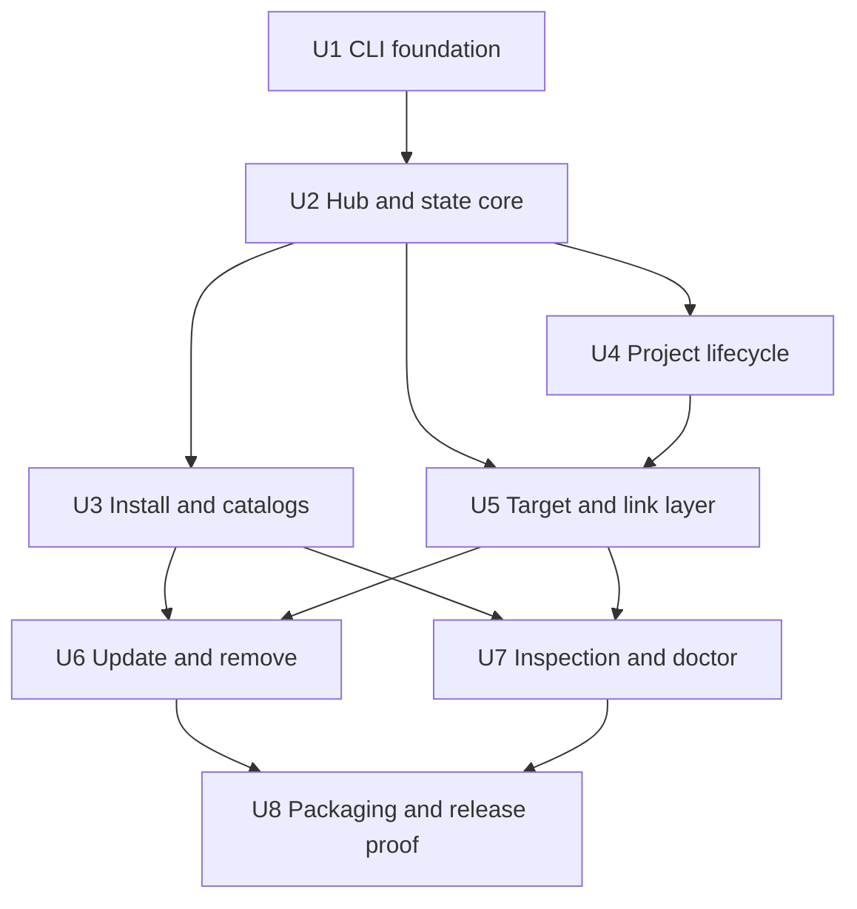

# Skill Port CLI v1 - Plan

## Goal Capsule

- **Objective:** 发布一个可长期使用的本地 Agent Skill 管理 CLI，闭环完成安装、注册、目录生成、项目或全局启用、禁用和诊断。
- **Product authority:** 本文件中的 Product Contract 是 v1 范围与行为的权威定义；与早期草稿冲突时以本文件为准。
- **Release floor:** `sklp enable` 报告成功后，目标 Agent 必须能够从其约定目录发现并使用该 Skill。
- **Execution profile:** Deep greenfield code plan；按 U-ID 依赖顺序实施，以 CLI 黑盒测试和三平台文件系统验证为主要证据。
- **Stop conditions:** 产品行为需要改动 R/F/AE、目标工具的真实发现目录与 R26 冲突，或 Node 24 的 SQLite 能力无法满足事务约束时停止并回到计划评审。
- **Tail ownership:** 实施者负责构建、跨平台 CI、npm 包冒烟和发布前检查；trusted publisher 绑定由维护者在发布前确认。
- **Open blockers:** 无。

---

## Product Contract

### Summary

Skill Port CLI v1 是一个通过 npm 发布的本地 Skill Hub CLI。
它集中安装和登记 Skill，自动生成面向机器与人的全局目录，并将 Skill 启用到当前项目或指定 Agent 的全局目录。

### Problem Frame

现有 `hk-skills` 已证明本地 Skill 管理存在真实需求，但使用入口集中在工具自身，无法在具体项目中建立清晰、可靠的关联。
安装过程也没有稳定保存 `name` 和 `description`，导致全局 catalog 难以持续生成，用户无法快速确认本机已安装哪些 Skill。

状态分散还会产生更严重的问题：命令可能声称启用成功，但目标目录中的入口缺失、错误或已漂移。
Skill Port CLI v1 必须优先保证安装状态、注册信息和真实文件系统入口一致。

### Key Decisions

| Decision | Rationale |
| --- | --- |
| Hub 集中存储 | 每个 Skill 只在本地 Hub 保存一份真实内容，项目和全局工具目录只消费入口。 |
| SQLite 权威状态 | 已安装 Skill、来源、项目和启用关系由 SQLite 表达，避免多个 registry 相互漂移。 |
| 本地关联保护隐私 | 项目绝对路径和关联关系只保存在本机，不向项目仓库写入 Skill Port 清单。 |
| 严格元数据契约 | 安装必须获得有效的 `name` 和 `description`，避免不可识别的 Skill 进入 Hub。 |
| 显式全局目标 | 全局启用一次只接受一个工具标识，降低误写多个工具目录的风险。 |
| 保守处理冲突和删除 | CLI 不覆盖未知内容；存在启用关系时默认拒绝删除 Skill。 |
| 诊断保持只读 | v1 提供 `doctor` 检查状态，不提供自动 `repair`。 |
| 验证真实可发现性 | 文件入口创建成功不足以判定启用成功，发布证据必须覆盖目标 Agent 的发现行为。 |

### Actors

- A1. **Local user:** 通过 `sklp` 安装、查看、启用、禁用、更新、删除和诊断 Skill。
- A2. **Skill Port CLI:** 管理 Hub、SQLite、注册信息、catalog 和受管入口。
- A3. **Agent tool:** 从项目或全局 Skill 目录发现并加载已启用的 Skill。

### Authority Model



该图只用于说明数据权责；完整行为以下方 Requirements 为准。

### Requirements

**Distribution and initialization**

- R1. Skill Port CLI must be distributed as an npm package that exposes the `sklp` executable on macOS, Linux, and Windows.
- R2. The default Hub location must be `~/.skill-port`, while initialization may allow the user to choose another local path.
- R3. `sklp init` must initialize local configuration and SQLite when needed, then register the current directory as a project without creating a project-owned Skill Port manifest.
- R4. Commands run below an initialized project must select the nearest registered ancestor from SQLite and must not infer project roots from Git or language-specific marker files.

**Installation and identity**

- R5. `sklp install` must support a local Skill directory and a Git repository whose selected Skill root contains `SKILL.md`.
- R6. Installation must parse `name` and `description` from `SKILL.md` YAML frontmatter and fail without registering partial state when either field is absent or invalid.
- R7. Each successful installation must receive an opaque `instanceId`; updates preserve it, while removal followed by reinstallation creates a new value.
- R8. Normalized Skill names must be unique within the Hub, and a conflict must fail with guidance to change the incoming Skill's `SKILL.md` name.
- R9. The CLI must not provide an install-time alias or rename option in v1.
- R10. Source type, sanitized source location, selected ref when applicable, resolved revision when available, and install/update timestamps must remain local and be available through `sklp info`.
- R11. Installation and update must avoid externally visible split state between Hub content, SQLite, `meta.json`, and generated catalogs.
- R12. An update that changes the registered Skill name must fail and direct the user to remove and reinstall it under the new name.

**Registration and catalogs**

- R13. Every installed Skill must have `<hub>/skills/<name>/meta.json`, whose v1 registration payload is limited to `instanceId`, `name`, and `description`.
- R14. `<hub>/catalog.json` must be the machine-readable global inventory, include a schema version, and expose only `instanceId`, `name`, and `description` for every installed Skill entry.
- R15. `<hub>/catalog.md` must be the human-readable global inventory and clearly list every installed Skill's name and description.
- R16. Both catalogs must be deterministic projections of SQLite and must refresh automatically after successful install, update, and remove operations.
- R17. Catalogs must not contain project paths, enablement records, local source paths, credentials, or other private machine state.
- R18. v1 must not expose a manual catalog regeneration command.

**Project enablement**

- R19. `sklp enable <skill>` must enable the Skill to the current initialized project's `.agents/skills/` directory.
- R20. `sklp disable <skill>` must remove the current project's managed entry without deleting Hub content.
- R21. `sklp enable <skill> --project <path>` and the corresponding disable form may target another initialized local project by explicit path.
- R22. Repeating enable or disable against an already-correct state must be safe and must not create duplicate enablement records.

**Global enablement**

- R23. Global enablement must use `sklp enable <skill> --global <tool>` and global disablement must use the corresponding disable form.
- R24. `--global` without a tool, multiple tools in one invocation, or simultaneous project and global targets must fail before changing state.
- R25. One Skill may be enabled independently to multiple supported global tools through separate commands.
- R26. v1 must support the following explicit global tool targets:

| Tool key | Agent-visible Skill directory |
| --- | --- |
| `claude` | `~/.claude/skills/` |
| `codex` | `~/.codex/skills/` |
| `cursor` | `~/.cursor/skills/` |
| `agents` | `~/.agents/skills/` |
| `pi` | `~/.pi/agent/skills/` |
| `opencode` | `~/.config/opencode/skills/`, with `~/.opencode/skills/` as the documented fallback |
| `trae` / `trae-cn` | `~/.trae/skills/` / `~/.trae-cn/skills/` |

**Filesystem safety and discoverability**

- R27. macOS and Linux targets must use directory symlinks; Windows must try a directory symlink and fall back to a junction when permissions prevent it.
- R28. Every successful enablement must record the actual entry location and link type in SQLite.
- R29. Enablement must verify that the resulting entry resolves to the intended Hub Skill and has the structure required by the selected Agent target before returning success.
- R30. A target location containing a regular file, regular directory, or unmanaged link must never be overwritten or deleted automatically.
- R31. Updating Hub content must preserve valid existing project and global enablements.
- R32. Disabling a Skill must remove only the matching managed entry and enablement record.

**Removal and diagnosis**

- R33. `sklp remove <skill>` must refuse removal while any project or global enablement exists and must list the blocking targets.
- R34. `sklp remove <skill> --force` must disable all managed targets before removing Hub content and registration state.
- R35. `sklp doctor` must remain read-only and check Hub availability, SQLite readability, Skill content, `meta.json`, both catalogs, registered projects, target entries, link destinations, link types, and database/filesystem drift.
- R36. `sklp doctor` must report the affected Skill or target and provide an actionable diagnosis without claiming that it repaired state.

**Inspection, errors, and privacy**

- R37. `sklp list` must present all installed Skills with at least name and description.
- R38. `sklp info <skill>` must present identity, source, timestamps, project enablements, global enablements, and current entry health from local state.
- R39. Failed mutating commands must return a nonzero exit code, explain the failed condition, and leave previously valid state usable.
- R40. Skill Port CLI must not inspect or modify `.gitignore`, `.git/info/exclude`, or other Git configuration as part of project enablement.
- R41. Logs, catalog output, and default human-readable errors must avoid exposing unrelated project paths or source credentials.

### Key Flows

- F1. Install and register a Skill
  - **Trigger:** A1 runs `sklp install` with a valid local or Git source.
  - **Actors:** A1, A2
  - **Steps:** The CLI validates metadata and uniqueness, installs content into the Hub, assigns an `instanceId`, registers local state, writes `meta.json`, and refreshes both catalogs.
  - **Outcome:** The Skill is visible through `list`, `info`, `catalog.json`, and `catalog.md`.
  - **Covered by:** R5-R18, R37-R39

- F2. Enable a Skill to the current project
  - **Trigger:** A1 runs `sklp enable <skill>` from an initialized project or descendant directory.
  - **Actors:** A1, A2, A3
  - **Steps:** The CLI resolves the nearest registered project, creates a managed entry under `.agents/skills/`, verifies the entry, and records the enablement.
  - **Outcome:** The project Agent can discover the Skill and repeated enablement is safe.
  - **Covered by:** R3-R4, R19-R22, R27-R32

- F3. Enable a Skill globally
  - **Trigger:** A1 runs `sklp enable <skill> --global <tool>`.
  - **Actors:** A1, A2, A3
  - **Steps:** The CLI validates one supported tool target, creates and verifies its managed entry, and records the global enablement.
  - **Outcome:** The selected Agent can discover the Skill without affecting other tools.
  - **Covered by:** R23-R32

- F4. Update an installed Skill
  - **Trigger:** A1 runs `sklp update <skill>`.
  - **Actors:** A1, A2, A3
  - **Steps:** The CLI obtains updated content, validates stable identity and metadata, replaces Hub content safely, refreshes registration artifacts, and verifies existing enablements.
  - **Outcome:** The Skill retains its `instanceId` and remains discoverable at every valid target.
  - **Covered by:** R7, R10-R12, R16, R31, R39

- F5. Remove an installed Skill
  - **Trigger:** A1 runs `sklp remove <skill>` with or without `--force`.
  - **Actors:** A1, A2
  - **Steps:** The CLI blocks removal when enablements exist unless forced; forced removal disables managed entries first, then deletes Hub and registration state and refreshes catalogs.
  - **Outcome:** No managed target is left pointing to removed Hub content.
  - **Covered by:** R16, R30, R32-R34, R39

- F6. Diagnose drift
  - **Trigger:** A1 runs `sklp doctor`.
  - **Actors:** A1, A2
  - **Steps:** The CLI compares SQLite with Hub content, registration artifacts, project records, target entries, and link destinations without mutating them.
  - **Outcome:** Drift and conflicts are reported with affected entities and actionable diagnoses.
  - **Covered by:** R35-R36, R41

### Acceptance Examples

- AE1. **Covers R6, R11.**
  - **Given:** A source has no valid `description` in `SKILL.md`.
  - **When:** The user runs `sklp install`.
  - **Then:** The command fails, and no Hub installation, SQLite Skill, `meta.json`, or catalog entry remains.

- AE2. **Covers R7-R9.**
  - **Given:** The Hub already contains a Skill whose normalized name is `repo-analyzer`.
  - **When:** The user installs a different Skill with the same normalized name.
  - **Then:** Installation fails and directs the user to change the incoming `SKILL.md` name; the installed Skill remains unchanged.

- AE3. **Covers R3-R4, R19, R29.**
  - **Given:** `<project>` 已注册，当前目录是 `<project>/packages/api`。
  - **When:** The user runs `sklp enable repo-analyzer`.
  - **Then:** The managed entry is created under `<project>/.agents/skills/`, resolves to the intended Hub content, and success is reported only after verification.

- AE4. **Covers R23-R25.**
  - **Given:** `repo-analyzer` is installed.
  - **When:** The user runs `sklp enable repo-analyzer --global codex`.
  - **Then:** Only the Codex global target is changed and the Skill remains independently disabled for other tools.

- AE5. **Covers R24, R39.**
  - **Given:** `repo-analyzer` is installed.
  - **When:** The user supplies bare `--global` or more than one global tool.
  - **Then:** The command exits nonzero before creating an entry or enablement record.

- AE6. **Covers R29-R30, R39.**
  - **Given:** The intended target entry is occupied by an unmanaged directory.
  - **When:** The user enables the Skill.
  - **Then:** The command exits nonzero, preserves the directory, and does not record a successful enablement.

- AE7. **Covers R31.**
  - **Given:** A Skill is enabled in one project and two global tools.
  - **When:** A valid update completes.
  - **Then:** All three entries resolve to the updated Hub content and each Agent target still discovers the Skill.

- AE8. **Covers R33-R34.**
  - **Given:** A Skill has active project or global enablements.
  - **When:** The user runs remove without `--force`.
  - **Then:** Removal is refused and the blocking targets are listed; with `--force`, managed entries are disabled before Hub content is removed.

- AE9. **Covers R35-R36.**
  - **Given:** A managed entry was deleted manually or now points to the wrong location.
  - **When:** The user runs `sklp doctor`.
  - **Then:** The command reports the drift and does not recreate, delete, or overwrite anything.

- AE10. **Covers R14-R17, R41.**
  - **Given:** Multiple Skills and private project associations exist.
  - **When:** Catalogs are regenerated by a successful mutation.
  - **Then:** Both catalogs describe the same installed Skill set and expose no project or private source paths.

### Success Criteria

- Every advertised Agent target has release evidence showing that a successfully enabled Skill is discovered from its project or global directory.
- The complete `init -> install -> list/info -> enable -> disable -> remove` loop passes as a black-box CLI workflow.
- Install, update, enable, disable, forced remove, and failure rollback preserve agreement between Hub content, SQLite, registration artifacts, catalogs, and managed entries.
- macOS, Linux, and Windows each have passing coverage for their advertised symlink or junction behavior.
- Catalogs always match the installed Skill set after successful install, update, and remove operations.
- No default catalog, project artifact, or diagnostic output leaks project association data.

### Scope Boundaries

**Deferred for later**

- Automatic repair and a `sklp repair` command.
- A manual catalog regeneration command.
- Batch enablement to multiple global tools in one command.
- `link` and `unlink` aliases that duplicate project-level `enable` and `disable`.
- Tags, JSON import/export, backup restoration, and migration workflows.
- Git repositories containing multiple selectable Skill subdirectories.
- Automatic discovery of unregistered project roots or unknown Agent tool directories.

**Outside this product's v1 identity**

- GUI applications.
- Remote marketplaces and hosted Skill content.
- Accounts, cloud synchronization, team permissions, ratings, comments, and social sharing.

### Dependencies and Assumptions

- Supported Agent tools continue to discover Skills from the directories listed in R26.
- Installable Skills provide YAML frontmatter containing usable `name` and `description` values.
- The local filesystem permits a supported symlink or junction strategy for the selected target.
- npm package naming and availability are separate from the product display name and `sklp` executable.

### Outstanding Questions

All planning-owned questions are resolved in the Planning Contract.

### Sources

- `docs/需求文档-草稿.md` for the original product framing, CLI surface, Hub authority, cross-platform constraints, and acceptance expectations.
- `private-doc.md` for the centralized Hub model and supported global Agent directory mappings.

---

## Planning Contract

### Product Contract Preservation

Product Contract changed only to close its planning-owned questions; all R/F/AE content and scope boundaries are unchanged.

### Key Technical Decisions

| ID | Decision | Rationale |
| --- | --- | --- |
| KTD1 | TypeScript ESM on Node.js 24.15 or newer | Node 24 is the active LTS line and 24.15 promotes `node:sqlite` to release-candidate status, avoiding native SQLite add-on installation across three operating systems. |
| KTD2 | Compile distributable JavaScript with `tsc`; use Node's stable test runner | The published package remains ordinary JavaScript while tests use the runtime's built-in process isolation and avoid a second test framework. |
| KTD3 | Separate commands, application services, domain types, and infrastructure adapters | CLI parsing, state transitions, SQLite, source retrieval, and filesystem links need independent tests and replaceable platform boundaries. |
| KTD4 | Use SQLite migrations and normalized repositories | `skills`, `sources`, `projects`, `targets`, `enablements`, `operations`, and catalog generation state enforce uniqueness and preserve inspectable relationships. |
| KTD5 | Serialize mutations with a Hub lock, durable operation journal, and operation workspace | Persisting intent before staged publication lets startup recovery distinguish owned interrupted work, restore backups, and prevent concurrent commands from publishing partial state. |
| KTD6 | Treat catalogs as versioned projections | Mutations render `meta.json`, `catalog.json`, and `catalog.md` from the same transactional snapshot, then publish them with atomic renames. |
| KTD7 | Use explicit source adapters | Local sources are copied from a validated directory; Git sources invoke the user's `git` executable with argument arrays and `shell: false`, inheriting credential helpers without storing credentials. |
| KTD8 | Keep tool targets in one typed registry | Project and global target resolution share validation and link creation while the registry owns supported keys, paths, fallback policy, and discoverability checks. |
| KTD9 | Make managed-entry ownership provable | Disable and remove operate only when SQLite identity, entry path, link type, and resolved Hub destination all agree; conflicts remain untouched. |
| KTD10 | Publish through npm trusted publishing when registry setup permits | OIDC removes long-lived write tokens and automatically emits provenance for a public package built with npm 11.5.1 or newer on a supported hosted runner. |

### High-Level Technical Design

The runtime is a thin CLI over application services. Domain rules do not depend on Commander, SQLite, Git, or platform-specific filesystem calls.



Every mutating command uses one operation boundary. Recovery here means completing or rolling back Skill Port's own interrupted transaction bookkeeping; it does not introduce the deferred `repair` command or alter unmanaged user content.



Enablement returns success only after ownership and discoverability checks pass.



### Data and Filesystem Contracts

- The default Hub contains `config.json`, `state.db`, `skills/`, `.staging/`, `catalog.json`, and `catalog.md`.
- Skill names use a platform-safe normalized slug and are rejected before becoming path components.
- SQLite enables foreign keys, a bounded busy timeout, and schema migrations; the Hub mutation lock remains the cross-resource serialization boundary.
- `operations` records mutation intent and terminal outcome without source credentials or unrelated project paths.
- The operation intent is durable before managed files are published; startup recovery must complete rollback or finalization before accepting another command.
- Atomic writers create sibling temporary files and replace destinations only after full serialization and flush.
- Startup removes abandoned staging work only when its operation record proves Skill Port ownership; all other drift remains visible to `doctor`.
- OpenCode resolves its primary directory first, uses the documented fallback only when the primary is absent and the fallback already exists, and creates the primary when neither exists.

### Security and Privacy Constraints

- Never interpolate source URLs, refs, names, or paths into a shell command.
- Reject source entries and symlinks that escape the selected Skill root, and never copy Git metadata into the Hub Skill directory.
- Redact URL credentials and sensitive query values before persisting source provenance or printing errors.
- Resolve and compare canonical paths before ownership checks; account for case-insensitive filesystems and Windows path prefixes.
- Catalog projections contain only the fields permitted by R13-R17.
- Project paths remain local to SQLite and explicit `info` or `doctor` output; routine list, catalog, and unrelated errors omit them.

### Output Structure

```text
package.json
package-lock.json
tsconfig.json
eslint.config.js
src/
  cli.ts
  commands/
  application/
  domain/
  infrastructure/
    database/
    filesystem/
    sources/
    targets/
  projections/
tests/
  unit/
  integration/
  e2e/
  fixtures/
scripts/
  smoke/
.github/
  workflows/
docs/
  supported-targets.md
  verification/
    agent-discovery.md
```

### Sequencing



### System-Wide Impact

- **Persistent state:** Schema migrations become a compatibility contract for every later CLI release.
- **Filesystem ownership:** Hub content and target entries cross process and operating-system boundaries; all destructive behavior depends on ownership proof.
- **External contracts:** Command names, flags, exit codes, catalog shape, npm executable installation, and supported tool paths are public interfaces.
- **Privacy:** Local project paths and private source provenance are durable user data even without cloud services.
- **Agent parity:** `catalog.json` supplies machine-readable inventory, while CLI commands remain primitive operations that agents can invoke without adding MCP or workflow orchestration in v1.

### Risks and Mitigations

| Risk | Impact | Mitigation |
| --- | --- | --- |
| `node:sqlite` is release-candidate in Node 24 | Runtime behavior or API may change within the LTS line | Pin the minimum Node minor, isolate SQLite behind repositories, and verify the supported Node matrix before release. |
| Filesystem and SQLite cannot share one native transaction | Interrupted commands can leave drift | Use lock, staging, backups, operation journal, startup cleanup, and fault-injection tests at every publish boundary. |
| Windows symlink privileges vary | Enablement fails on common user machines | Attempt directory symlink, fall back to junction, record the actual type, and test both paths on Windows CI. |
| Tool discovery paths change | CLI creates a valid link that an Agent no longer reads | Keep one target registry, document the tested version/date, and require release smoke evidence for every advertised target. |
| Git URLs or Skill names contain hostile input | Shell injection, path traversal, or credential leakage | Spawn without a shell, validate path components, constrain copied content, and sanitize persisted provenance. |
| Two CLI processes mutate one Hub | Lost updates or catalog/state disagreement | Acquire one bounded Hub mutation lock and return an actionable busy error when it cannot be obtained. |
| npm package name becomes unavailable before first publish | Publication metadata must change late | Recheck registry ownership immediately before first publish; changing package metadata must not change the `sklp` executable or product name. |

### Alternatives Considered

- **Native SQLite dependency:** Broader Node compatibility, but native prebuild and compilation failures add three-platform installation risk.
- **JSON registry as authority:** Easier initial implementation, but reproduces the state drift that motivated the product.
- **Copy Skill content into every target:** Avoids link permissions, but creates multiple mutable copies and breaks Hub authority.
- **Automatic project discovery:** Reduces initialization friction, but reintroduces ambiguous Git and language-marker heuristics that the Product Contract rejected.
- **Automatic repair:** Can hide ownership mistakes and overwrite user state; v1 keeps diagnosis read-only.

### Planning Research

- [Node.js release policy](https://nodejs.org/en/about/previous-releases) supports choosing an active LTS line for production.
- [Node.js SQLite documentation](https://nodejs.org/download/release/latest-v24.x/docs/api/sqlite.html) records `node:sqlite` as release candidate from Node 24.15.
- [Node.js filesystem documentation](https://nodejs.org/api/fs.html) defines directory symlink and Windows junction behavior, including absolute junction targets.
- [Node.js child process documentation](https://nodejs.org/api/child_process.html) supports argument-array spawning without a shell.
- [npm package metadata](https://docs.npmjs.com/files/package.json/) defines `bin` packaging, and [npm publish](https://docs.npmjs.com/cli/publish/) recommends inspecting package contents with a dry run.
- [npm trusted publishing](https://docs.npmjs.com/trusted-publishers/) documents OIDC publishing and automatic provenance.
- [Git clone documentation](https://git-scm.com/docs/git-clone.html) defines ref and shallow-clone behavior used by the Git source adapter.

### Resolution of Product Questions

| Product question | Planning resolution |
| --- | --- |
| Supported Node.js runtime | Require Node 24.15 or newer within the Node 24 LTS line for the v1 package. |
| npm package name | Use `skill-port-cli`, confirmed unregistered in the npm registry on 2026-07-09; keep the display name and `sklp` executable invariant. |
| Skill name normalization | Accept lowercase ASCII segments separated by single hyphens; reject path separators, traversal segments, whitespace, uppercase, and platform-reserved names. |
| Git source behavior | Require the local Git executable, support default HEAD or one explicit ref, inherit credential helpers, store a sanitized origin and resolved commit, and omit multi-Skill subdirectories. |
| OpenCode target fallback | Prefer the primary directory, use an existing fallback only when the primary is absent, and create the primary when neither exists. |

---

## Implementation Units

### U1. Establish the npm CLI foundation

- **Goal:** Create the TypeScript package, executable entry point, command registry, typed result/error boundary, and development quality gates.
- **Requirements:** R1, R39; supports F1-F6.
- **Dependencies:** None.
- **Files:** `package.json`, `package-lock.json`, `tsconfig.json`, `eslint.config.js`, `src/cli.ts`, `src/commands/index.ts`, `src/domain/result.ts`, `src/domain/errors.ts`, `tests/e2e/cli-help.test.ts`.
- **Approach:** Use Commander for parsing and help, inject application services into command handlers, centralize exit-code and redaction behavior, and keep stdout for successful results and stderr for diagnostics.
- **Execution note:** Start with package-install and CLI-process smoke tests because executable wiring is the first product risk.
- **Patterns to follow:** KTD1-KTD3; npm `bin` packaging rules; Node test-runner process isolation.
- **Test scenarios:**
  - Running the built executable with `--help` exits zero and lists only the v1 command surface.
  - An unknown command and malformed target flags exit nonzero without a stack trace.
  - A command handler failure is rendered once on stderr and leaves stdout clean.
  - The package engine guard rejects unsupported Node versions with an actionable message.
- **Verification:** A packed local tarball installs into a clean temporary prefix and exposes a working `sklp` executable.

### U2. Build Hub configuration, SQLite state, and mutation coordination

- **Goal:** Establish deterministic Hub paths, migrations, repositories, project registration, operation locking, and cross-resource transaction recovery.
- **Requirements:** R2-R4, R7-R11, R28, R39-R41; supports F1-F6.
- **Dependencies:** U1.
- **Files:** `src/application/init-service.ts`, `src/domain/models.ts`, `src/infrastructure/config.ts`, `src/infrastructure/database/migrations.ts`, `src/infrastructure/database/repositories.ts`, `src/infrastructure/filesystem/operation-coordinator.ts`, `src/infrastructure/filesystem/atomic-writer.ts`, `tests/unit/config.test.ts`, `tests/integration/database.test.ts`, `tests/integration/operation-coordinator.test.ts`.
- **Approach:** Keep schema changes versioned, use foreign keys and uniqueness constraints, canonicalize paths at the boundary, and wrap every mutation in a bounded Hub lock plus staged operation workspace.
- **Execution note:** Add fault injection before feature services so later units inherit proven rollback behavior.
- **Patterns to follow:** KTD4-KTD6; the mutation lifecycle in High-Level Technical Design.
- **Test scenarios:**
  - First initialization creates the selected Hub and registers the canonical current project; a repeat is idempotent.
  - A nested working directory resolves the nearest registered ancestor and does not inspect Git markers.
  - Duplicate normalized Skill identity, project path, target path, or enablement is rejected by storage constraints.
  - A fresh database migrates to the latest schema once, and reopening it does not rerun completed migrations.
  - A second process cannot acquire the Hub mutation lock and exits without changing state.
  - Failure before and after each publish boundary restores the prior database and managed files.
  - A simulated crash after filesystem publication but before database commit is restored from the durable journal and backups on the next startup.
  - Startup removes only staging data tied to an interrupted owned operation.
- **Verification:** Migration, locking, rollback, and restart tests leave a single consistent state snapshot after every injected failure.

### U3. Implement source ingestion, metadata validation, and catalog projections

- **Goal:** Install valid local or Git Skill roots into the Hub and publish strict per-Skill and global registration artifacts.
- **Requirements:** R5-R18, R37, R39, R41; covers F1 and AE1-AE2, AE10.
- **Dependencies:** U2.
- **Files:** `src/application/install-service.ts`, `src/infrastructure/sources/local-source.ts`, `src/infrastructure/sources/git-source.ts`, `src/domain/skill-metadata.ts`, `src/projections/meta-projector.ts`, `src/projections/catalog-projector.ts`, `tests/unit/skill-metadata.test.ts`, `tests/integration/install.test.ts`, `tests/integration/catalog.test.ts`, `tests/fixtures/skills/`.
- **Approach:** Stage source content, parse only the leading YAML frontmatter with the `yaml` package, validate a safe unique name and nonempty description, generate `instanceId`, strip Git metadata, and render deterministic catalogs from the transaction snapshot.
- **Patterns to follow:** KTD5-KTD7; security and privacy constraints.
- **Test scenarios:**
  - Covers AE1. Missing, malformed, or non-string metadata fails without leaving Hub, SQLite, meta, or catalog state.
  - Covers AE2. A normalized duplicate name fails and preserves the existing installation byte-for-byte.
  - A valid local Skill is copied into the Hub and appears identically in list, `meta.json`, `catalog.json`, and `catalog.md`.
  - A Git source at default HEAD or explicit ref records a sanitized source and resolved commit.
  - A source symlink or path that escapes the Skill root is rejected.
  - Catalog ordering is stable and entries expose only `instanceId`, `name`, and `description`.
  - A catalog write failure rolls back installation and restores prior catalogs.
- **Verification:** Local and Git black-box installs produce one authoritative Skill and privacy-safe deterministic projections.

### U4. Implement project registration and project enablement

- **Goal:** Enable and disable installed Skills for the current or explicit registered project through `.agents/skills/`.
- **Requirements:** R3-R4, R19-R22, R27-R32, R39-R41; covers F2 and AE3, AE6.
- **Dependencies:** U2, U3.
- **Files:** `src/application/project-service.ts`, `src/application/enablement-service.ts`, `src/commands/init.ts`, `src/commands/enable.ts`, `src/commands/disable.ts`, `src/infrastructure/targets/project-target.ts`, `tests/integration/project-discovery.test.ts`, `tests/integration/project-enablement.test.ts`.
- **Approach:** Resolve only registered projects, compute one canonical entry, check ownership before mutation, delegate link creation to the shared adapter, and commit enablement only after postcondition verification.
- **Patterns to follow:** KTD8-KTD9; enablement decision flow.
- **Test scenarios:**
  - Covers AE3. A command from a nested directory targets the nearest registered project and creates a discoverable entry.
  - An explicit path targets another registered project; an unregistered path fails without creating `.agents/skills/`.
  - Re-enabling a correct entry and re-disabling an absent managed relationship are safe and do not duplicate records.
  - Covers AE6. A regular file, directory, wrong link, or link owned by another Skill is preserved and reported as a conflict.
  - Disabling removes only a matching owned entry and retains Hub content.
  - Project enablement neither reads nor edits Git configuration.
- **Verification:** CLI integration tests prove project resolution, entry ownership, idempotence, conflict safety, and Hub preservation.

### U5. Implement global target resolution and cross-platform links

- **Goal:** Support every R26 tool key through one target registry and verified symlink or junction behavior.
- **Requirements:** R23-R32, R39; covers F3 and AE4-AE7.
- **Dependencies:** U2, U3, U4.
- **Files:** `src/infrastructure/targets/tool-registry.ts`, `src/infrastructure/targets/global-target.ts`, `src/infrastructure/filesystem/link-adapter.ts`, `src/domain/enablement.ts`, `tests/unit/tool-registry.test.ts`, `tests/integration/global-enablement.test.ts`, `tests/integration/link-adapter.test.ts`.
- **Approach:** Parse exactly one tool key, resolve home-relative paths through the injected environment, apply the OpenCode fallback rule, create directory links per platform, and persist the actual link type.
- **Patterns to follow:** KTD8-KTD9; Node filesystem platform behavior.
- **Test scenarios:**
  - Covers AE4. Enabling Codex changes only the Codex target and records one global enablement.
  - Covers AE5. Bare, unknown, or multiple global tools fail before filesystem or database mutation.
  - Every supported tool key resolves to the Product Contract path under a synthetic home directory.
  - OpenCode chooses primary, existing fallback, and create-primary cases deterministically.
  - Unix creates and verifies a directory symlink; Windows uses a directory symlink when available and a junction after a simulated privilege failure.
  - Covers AE7. One Skill can remain discoverable in a project and multiple global targets.
  - A post-create verification failure removes only the newly created managed entry and records no enablement.
- **Verification:** Platform adapter tests and OS-matrix integration tests prove exact path mapping, fallback, link type, and no false-positive success.

### U6. Implement safe update and removal lifecycles

- **Goal:** Update Hub content without breaking enablements and remove Skills under the confirmed guarded semantics.
- **Requirements:** R7, R10-R12, R16, R30-R34, R39; covers F4-F5 and AE7-AE8.
- **Dependencies:** U3, U5.
- **Files:** `src/application/update-service.ts`, `src/application/remove-service.ts`, `src/commands/update.ts`, `src/commands/remove.ts`, `tests/integration/update.test.ts`, `tests/integration/remove.test.ts`.
- **Approach:** Reuse the source adapter and operation coordinator, preserve `instanceId`, reject name changes, verify all active entries after content replacement, and require ownership proof before forced disablement.
- **Patterns to follow:** KTD5-KTD7, KTD9.
- **Test scenarios:**
  - A valid update preserves `instanceId`, refreshes description and revision, and keeps every active entry discoverable.
  - A changed name, invalid metadata, unreachable source, or failed verification restores the prior content and catalogs.
  - Covers AE8. Normal removal lists active targets and changes nothing.
  - Forced removal disables every owned entry before deleting Hub and state.
  - Forced removal stops on an unmanaged conflict and preserves the Skill for diagnosis.
  - Reinstallation after successful removal produces a new `instanceId`.
- **Verification:** Fault-injected lifecycle tests prove stable identity, active-link continuity, guarded force semantics, and rollback.

### U7. Implement inspection and read-only diagnosis

- **Goal:** Deliver `list`, `info`, and `doctor` with privacy-aware output and complete drift detection.
- **Requirements:** R17, R35-R41; covers F6 and AE9-AE10.
- **Dependencies:** U3, U4, U5, U6.
- **Files:** `src/application/query-service.ts`, `src/application/doctor-service.ts`, `src/commands/list.ts`, `src/commands/info.ts`, `src/commands/doctor.ts`, `src/domain/diagnostics.ts`, `tests/integration/list-info.test.ts`, `tests/integration/doctor.test.ts`, `tests/unit/redaction.test.ts`.
- **Approach:** Build diagnostics as pure observations over repositories and filesystem probes, assign stable diagnostic codes and severity, and render scoped details without any mutation path.
- **Patterns to follow:** KTD3, KTD8-KTD9; Product Contract privacy constraints.
- **Test scenarios:**
  - `list` returns every installed name and description without project or source paths.
  - `info` returns one Skill's sanitized source, timestamps, enablements, and entry health.
  - Covers AE9. Missing, wrong-destination, wrong-type, and unmanaged replacement entries are reported without modification.
  - Missing Hub content, malformed `meta.json`, stale catalog generations, unreadable SQLite, and stale project registrations produce distinct diagnostics.
  - Capturing filesystem snapshots before and after `doctor` proves no managed or unmanaged content changed.
  - Credential-bearing source URLs are redacted in output and stored diagnostics.
- **Verification:** Snapshot and black-box tests prove complete diagnosis, zero mutation, stable exit behavior, and privacy.

### U8. Prove packaging, platform support, and release readiness

- **Goal:** Add CI, npm artifact validation, supported-target documentation, and a secure publication path.
- **Requirements:** R1, R26-R29 and all Success Criteria.
- **Dependencies:** U6, U7.
- **Files:** `.github/workflows/ci.yml`, `.github/workflows/publish.yml`, `scripts/smoke/npm-install.mjs`, `scripts/smoke/agent-discovery.mjs`, `tests/e2e/core-loop.test.ts`, `docs/supported-targets.md`, `docs/verification/agent-discovery.md`, `README.md`.
- **Approach:** Run build and tests on macOS, Linux, and Windows; install the packed tarball into a clean prefix; exercise the full core loop in temporary homes; gate publishing on the complete matrix and trusted publishing configuration.
- **Execution note:** Treat runtime and packaged-artifact smoke evidence as the final proof; unit coverage alone cannot satisfy the release floor.
- **Patterns to follow:** KTD1-KTD2, KTD8, KTD10; npm package and trusted-publishing guidance.
- **Test scenarios:**
  - A clean tarball install exposes `sklp`, excludes source/tests/private fixtures, and runs with no repository checkout.
  - The full `init -> install -> list/info -> enable -> disable -> remove` flow passes against a temporary Hub and project.
  - Every R26 tool mapping passes an Agent-visible directory contract test; each advertised real tool has a dated discovery smoke result recorded before release.
  - Linux and macOS validate symlinks; Windows validates both symlink and junction branches.
  - The CI log and packaged catalogs contain no fixture credentials or host project paths.
  - Publish dry run reports only intended files and the release workflow cannot run before the test matrix succeeds.
- **Verification:** One release candidate tarball passes the three-platform matrix, core-loop smoke, target-discovery evidence, and package-content inspection.

---

## Verification Contract

| Gate | Command | Applies to | Required evidence |
| --- | --- | --- | --- |
| Dependency reproducibility | `npm ci` | U1-U8 | Clean install from the committed lockfile on all CI operating systems. |
| Static quality | `npm run lint` | U1-U8 | No lint errors in source, tests, scripts, or config. |
| Type safety | `npm run typecheck` | U1-U8 | TypeScript completes with strict settings and erasable runtime syntax constraints. |
| Unit and integration behavior | `npm test` | U1-U7 | All test-runner suites pass with isolated temporary homes and Hubs. |
| Distribution build | `npm run build` | U1-U8 | `dist/` contains executable JavaScript and declarations with no source-only imports. |
| Package contents | `npm pack --dry-run` | U1, U8 | Only intended runtime files, README, license, and package metadata are included. |
| Packed CLI smoke | `npm run test:package` | U1, U8 | Tarball installs into a clean prefix and `sklp --help` plus the core loop pass. |
| Platform links | `npm run test:platform` | U4-U8 | macOS/Linux symlinks and Windows symlink/junction behavior pass on native runners. |
| Agent discovery | `npm run test:discovery` | U5, U8 | Every advertised target mapping resolves and each release-supported Agent has recorded smoke evidence. |

Release validation requires all gates. A skipped platform or Agent discovery check blocks advertising that platform or target.

---

## Definition of Done

### Global Completion

- The Product Contract remains unchanged and every R-ID, F-ID, and AE-ID is implemented, verified, or explicitly retained under Scope Boundaries.
- All U1-U8 verification outcomes and the full Verification Contract pass from a clean checkout.
- `sklp enable` never returns success unless the managed entry resolves to valid Hub content at the selected Agent discovery location.
- Install, update, enable, disable, remove, interruption, and concurrency tests leave Hub, SQLite, metadata, catalogs, and managed entries consistent.
- Catalog and routine output privacy checks show no project associations, local source paths, credentials, or unrelated absolute paths.
- The packed npm artifact works independently of the repository on macOS, Linux, and Windows.
- README and supported-target documentation match the shipped command surface, runtime floor, target paths, and known platform prerequisites.
- No deferred command or product feature has entered the runtime surface.
- Experimental, abandoned, duplicate, or dead-end implementation code is removed from the final diff.

### Unit Completion

| Unit | Done signal |
| --- | --- |
| U1 | A clean packed install exposes a correctly behaving `sklp` process. |
| U2 | Migrations, locks, fault injection, rollback, and restart recovery preserve one coherent state. |
| U3 | Local and Git installs produce strict identity, metadata, and deterministic privacy-safe catalogs. |
| U4 | Current and explicit registered projects support safe, idempotent enable and disable. |
| U5 | Every supported global target resolves correctly and records a verified platform link type. |
| U6 | Updates preserve active discovery and guarded removal leaves no broken managed entries. |
| U7 | Queries are useful and `doctor` detects drift without mutating any content. |
| U8 | The release candidate passes native OS, package, core-loop, target-discovery, and publication gates. |
